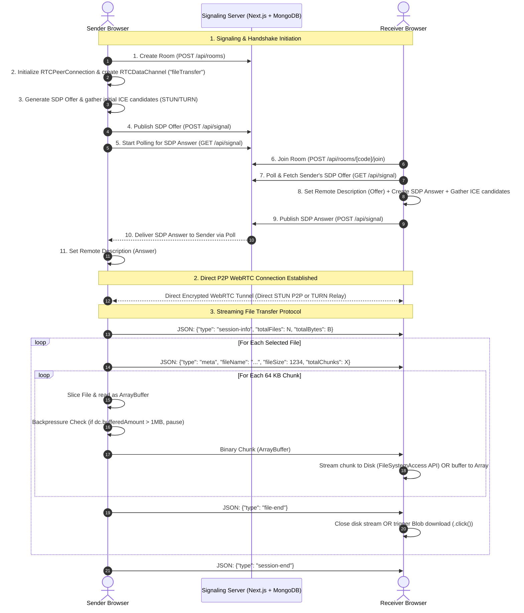

# 🚀 System Architecture & File Transfer Flow

A comprehensive, technical breakdown of the **Direct Peer-to-Peer (P2P) File Transfer System**: how it works, the technologies used, cross-network NAT traversal mechanisms, signaling protocol, and end-to-end file streaming lifecycle.

---

## 1. System Overview & Core Philosophy

This application is an **enterprise-grade, direct browser-to-browser P2P file transfer platform** built with **Next.js**, **WebRTC DataChannels**, and a **MongoDB-backed HTTP Signaling Server**.

### 🔒 Core Privacy & Performance Principles
- **Zero Cloud File Storage**: Files are **never** uploaded to a server, cloud bucket, or database.
- **No File Size Limits**: Files stream directly from sender RAM/disk to receiver RAM/disk.
- **End-to-End Encryption**: Data channels are secured by DTLS/SCTP over WebRTC.
- **Serverless-Friendly Signaling**: Operates on serverless platforms (like Vercel) using adaptive HTTP polling through MongoDB without requiring persistent WebSocket connections.

```
                           ┌──────────────────────────────────────────────┐
                           │            NEXT.JS / MONGODB BACKEND         │
                           │   • Room Registry (/api/rooms)               │
                           │   • SDP & ICE Signaling Relay (/api/signal)  │
                           │   • Transfer Analytics & Event Logging       │
                           └──────────────────────┬───────────────────────┘
                                                  │
                                   HTTP Polling / Signal Exchange
                                                  │
                 ┌────────────────────────────────┴────────────────────────────────┐
                 ▼                                                                 ▼
  ┌─────────────────────────────┐                                   ┌─────────────────────────────┐
  │       SENDER (Client)       │                                   │      RECEIVER (Client)      │
  │     (src/app/dashboard)     │                                   │     (src/app/receive)       │
  │ • File Slicer (64 KB chunks)│◄═════════════════════════════════►│ • Direct-to-Disk Streamer   │
  │ • Backpressure Controller   │     Direct P2P WebRTC DataChannel │ • Blob Reassembler          │
  │ • RTCDataChannel Manager    │      (STUN Direct / TURN Relay)   │ • Auto-Download Trigger     │
  └─────────────────────────────┘                                   └─────────────────────────────┘
```

---

## 2. Component Architecture Breakdown

| Layer / Subsystem | Location | Role & Technical Responsibility |
|---|---|---|
| **Signaling Hook** | `src/hooks/useSignaling.js` | Manages room creation, room joining, client identity (`sessionStorage`), and adaptive HTTP polling (`/api/signal`) for SDP offers, SDP answers, and trickle ICE candidates. |
| **WebRTC Hook** | `src/hooks/useWebRTC.js` | Encapsulates `RTCPeerConnection`, data channel lifecycle, STUN/TURN ICE configurations, 64 KB binary chunking, and backpressure queueing. |
| **Sender Interface** | `src/app/dashboard/page.js` | UI for file selection (drag-and-drop, folder selection), room ID generation, live transfer statistics (speed, ETA, progress), and transmission trigger. |
| **Receiver Interface** | `src/app/receive/page.js` | UI for room connection (via code or share link), chunk streaming, native File System Access API writing, fallback Blob assembly, and auto-downloading. |
| **Signaling API** | `src/app/api/signal/route.js` | Ephemeral message broker stored in MongoDB (`Signal` collection) that relays signaling messages between peers and auto-purges consumed signals. |
| **Room Management API** | `src/app/api/rooms/route.js` & `src/app/api/rooms/[code]/join/route.js` | Validates room availability, tracks client membership, limits room capacity to 2 peers, and records transfer sessions. |
| **Database Models** | `src/models/` (`Signal.js`, `Room.js`, `Transfer.js`, `Log.js`) | MongoDB schemas for ephemeral signaling, active rooms, transfer audit records, and system telemetry. |

---

## 3. End-to-End File Transfer Sequence



---

## 4. Deep Dive: Transfer Protocols & Mechanics

### A. Binary Chunking & Flow Control (Backpressure)
To transfer multi-gigabyte files reliably without exceeding browser memory limits or crashing the WebRTC internal buffer:
- **Chunk Size**: Files are sliced into **64 KB** (`64 * 1024` bytes) binary pieces.
- **Backpressure Mechanism** (`src/hooks/useWebRTC.js`):
  ```javascript
  // Pause sending if RTCDataChannel internal buffer exceeds 1MB
  while (dc.bufferedAmount > 1024 * 1024) {
    if (isCancelled && isCancelled()) return;
    await new Promise((r) => setTimeout(r, 40));
  }
  ```
- **Throughput & Speed Calculation**: Measured dynamically every 250ms based on bytes transferred over elapsed time:
  $$\text{Speed} = \frac{\Delta \text{Bytes}}{\Delta \text{Time}}$$
  $$\text{ETA} = \frac{\text{Remaining Bytes}}{\text{Speed}}$$

---

### B. Dual Receiving Strategy
The receiver dynamically selects the optimal download strategy depending on browser capabilities:

1. **Direct-to-Disk Streaming (Modern Browsers / Chromium)**:
   - Uses the native **File System Access API** (`window.showSaveFilePicker()`).
   - Receives each 64 KB chunk over the data channel and writes it immediately to a writable disk stream (`FileSystemWritableFileStream`).
   - **Advantage**: Zero RAM consumption—can receive 50 GB+ files without browser memory exhaustion.

2. **In-Memory Blob Fallback (Safari / Firefox / Mobile Browsers)**:
   - Collects binary chunks in an in-memory queue.
   - When the `file-end` message is received, constructs a binary `Blob`:
     ```javascript
     const blob = new Blob(chunks, { type: meta.fileType || 'application/octet-stream' });
     const url = URL.createObjectURL(blob);
     ```
   - Triggers automatic download via a hidden `<a>` element simulation.

---

### C. NAT Traversal & Cross-Network Connectivity
The application guarantees connectivity across different networks (Home Wi-Fi, Office Firewalls, 4G/5G mobile):

- **STUN Servers**:
  - `stun:stun.l.google.com:19302`
  - `stun:stun.cloudflare.com:3478`
  - `stun:openrelay.metered.ca:80`
  - *Role*: Discovers the public IP and NAT mapping port for direct peer-to-peer punching.

- **TURN Relay Fallback**:
  - `turn:openrelay.metered.ca:80` & `turn:openrelay.metered.ca:443` (UDP and TCP)
  - *Role*: If both devices are behind symmetric/carrier-grade NATs that block direct P2P holes, traffic securely relays through the TURN server on standard web ports (80/443).

---

### D. Adaptive HTTP Signaling Protocol
Because serverless environments (e.g. Vercel) terminate long-lived WebSocket connections, signaling is built on an adaptive HTTP polling cycle:
- **Fast Phase**: Polls every **500ms** during initial handshake (first 20 requests) for instant room matching.
- **Steady Phase**: Switches to **1200ms** once connected.
- **Exponential Backoff**: Backs off up to 8000ms if consecutive request failures occur.
- **Atomic ICE Bundling**: Bundles initial gathered ICE candidates directly into the initial SDP payload to minimize signaling round-trips.
